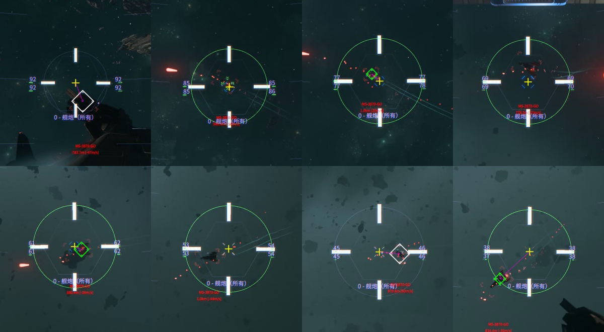

# StarCitizen AIGuner

[中文](README.md)

This is an automatic turret gunner I built for my own Star Citizen credit farming runs (高塔). I've tested the complete setup in-game and use it myself.

It watches the HUD, follows the lead pip, and uses a Pico to send mouse input to the turret. It can find locked targets, turn toward them and fire when they come into range. It doesn't read game memory or inject code into the game.

My setup is **Windows, Python and a Pico 2 W**, with a **2560×1440 display and a Polaris turret in FPS mouse mode**. The included settings are tuned for that setup. If you change the resolution, turret or sensitivity, you'll need to adjust them.

## Disclaimer

I made this for my own credit farming runs and am sharing the code to show how it works. **CIG does not allow this kind of automation. Using it may result in a ban or other account penalties.**

Whether to use it is your decision. You are responsible for any bans, account losses or other consequences from using this project. I accept no responsibility for those consequences.



## How it works

The game already draws a lead pip, so I use that as the aiming point. There's no large language model or cloud API involved.

**DXCAM** captures the screen. **OpenCV** finds the crosshair, lead pip and range ring using their colors and shapes. When the pip isn't visible, the controller follows the red target label or off-screen arrow. If it can't find a locked target, it tries pressing T.

A **Kalman filter** tracks the pip's position and velocity through short gaps in detection. The controller uses **PD control, velocity feed-forward and a Smith predictor** to turn that into mouse movement. The delay matters: a mouse command takes a few frames to show up as turret motion. I keep track of commands that haven't appeared on screen yet so the controller doesn't keep correcting the same error and overshoot.

**pyserial** sends the commands over USB to the Pico. The firmware is written in **C with the Pico SDK and TinyUSB**, and presents serial and HID interfaces to the computer. Everything runs on the gaming PC with the Pico plugged into USB; no second PC or Wi-Fi connection is needed.

```text
Game screen → DXCAM → OpenCV → tracking and control → USB serial → Pico → mouse/keyboard input
```

More detail is in the [implementation notes](docs/architecture.md) and [HUD notes](docs/hud.md).

## Installation

You'll need a Pico 2 W, a USB data cable, Python 3.12 and Git. The live controller runs on Windows.

In PowerShell:

```powershell
git clone https://github.com/LouieLumi/StarCitizen-AIGuner.git
cd StarCitizen-AIGuner
py -3.12 -m venv .venv
.venv\Scripts\python.exe -m pip install -r requirements.txt
```

Build and flash the Pico using the [firmware instructions](docs/firmware.md). This needs the ARM toolchain, Pico SDK, CMake, Ninja and picotool. Once flashed, it appears as `AI Crew Controller`; the host finds its serial port automatically.

Edit [`config/config.yaml`](config/config.yaml) for your screen and monitor. The default ROI starts at `(680,270)` and is `1200×900` pixels. `aim` coordinates are relative to that ROI. At other resolutions, you'll also need to adjust the finder exclusion areas, shape sizes and range-ring radius; they don't scale automatically.

You can copy the config to `config/config.local.yaml` and pass `--config config/config.local.yaml` when starting. Git ignores that local file.

## Usage

Enter the turret and switch it to **FPS mouse mode**. The controller is tuned for that mode; in virtual joystick mode, stopping mouse movement can leave the turret turning.

For normal use, double-click **`start_gunner.bat`**. It starts with tracking and automatic fire enabled.

The floating panel has two switches: **火控系统** controls target locking, search and tracking; **武器系统** controls automatic fire. You can leave tracking on and fire manually. Drag the panel to move it and use its lock button to hold it in place.

Input pauses when you switch away from the game. Close the console or press Ctrl+C to quit. **Turn off fire control before opening chat**, or the automatic T key can end up in your message.

From a terminal in the project directory:

```powershell
# Start with both switches off; turn them on in the panel
.venv\Scripts\python.exe host\main.py

# Start tracking and auto fire, just like the batch file
.venv\Scripts\python.exe host\main.py --enable --auto-fire

# Run detection and tracking without sending input; no Pico needed
.venv\Scripts\python.exe host\main.py --dry-run --enable --seconds 30
```

Run these in the logged-in Windows desktop session. For SSH, see `desktop_run.ps1` in the [usage guide](docs/usage.md).

Auto fire starts after the range signal stays stable, then keeps firing until the target has been lost for one second. Change that delay with `fire.stop_after_unlocked_s`. Turning either switch off stops firing. The Pico also releases its outputs after 100 ms without new commands.

## Working on it

`host/` contains the Python code and `firmware/` contains the Pico code. Recording, replay, detection debugging and calibration tools live in `tools/`; commands are in the [usage guide](docs/usage.md).

If you change turrets or sensitivity, `tools/turret_ident.py` can help measure the response delay, smoothing and gain. Offline replay lets you tune detection against the same recording without connecting a Pico. Logs and recordings go to `logs/` and `recordings/`, both ignored by Git. Lossless video uses a lot of disk space.

See [CONTRIBUTING.md](CONTRIBUTING.md) for offline tests. If you open an issue, include your resolution, turret, config and a frame showing the problem where possible.

## License

I'm sharing the code for people to study, use and modify **for noncommercial purposes**. The terms are in [PolyForm Noncommercial 1.0.0](LICENSE). Keep the license and [copyright notice](NOTICE) when redistributing it.

This is a personal project, with no official connection to CIG or RSI. Star Citizen imagery and trademarks belong to their respective owners.
