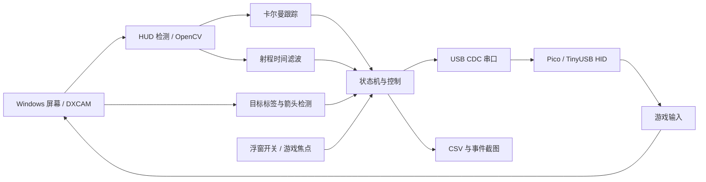

# 架构与验证范围

[返回首页](../README.md)

## 数据流

Python 主机与游戏运行在同一个 Windows 桌面会话；Pico 通过 USB 同时接收串口命令并提供 HID 输入，不需要第二台计算机或网络 API。

## 模块职责

| 文件 | 职责 |
|---|---|
| `host/capture.py` | DXGI 屏幕捕获、物理像素坐标、帧时间戳 |
| `host/detector.py` | 根据颜色和形状检测准星、提前量点、射程圈 |
| `host/tracker.py` | 卡尔曼预测、测量门控、确认轨迹、短暂丢失处理 |
| `host/own_motion.py` | 对已发鼠标命令的延迟/平滑响应建模，分离自身运动 |
| `host/controller.py` | PD、速度前馈、死区、增益调度和位移限幅 |
| `host/target_finder.py` / `search.py` | 锁定目标标签/屏幕外箭头检测与转向搜索 |
| `host/weapon_range.py` | 时间和帧数共同约束射程判定 |
| `host/fire_control.py` | 开火触发、目标丢失宽限、可选连发时长限制 |
| `host/state_machine.py` | DISABLED、ARMED、SEARCHING、TRACKING、READY、FIRING、TARGET_LOST、EMERGENCY_STOP 状态 |
| `host/main.py` | 串联各模块、控制输出、处理焦点与停止请求 |
| `host/control_panel.py` / `game_window.py` | Windows 浮窗与前台进程判断 |
| `host/pico_link.py` | 按 VID/PID 查找串口、编码命令 |
| `host/logger.py` / `recorder.py` | 每帧 CSV、事件截图、录像和时间戳 |

## 控制行为

跟踪目标是游戏 HUD 的提前量点，项目本身不推算弹道。完整点形状用于新轨迹确认；有已有轨迹时可使用部分遮挡观测。自身转向引起的画面运动会从跟踪器估计中扣除，控制器使用尚未显现在画面上的转向量进行预估补偿。

自动开火开关与火控开关独立。射程信号通过连续帧和时间阈值后可触发开火，触发后会持续到目标丢失超过 `fire.stop_after_unlocked_s`；并非每次准星偏离或射程信号变色都立即松开。关闭武器/火控、失去游戏焦点或退出会释放相应输出。

默认主程序不开启两个开关；批处理入口和显式 `--enable --auto-fire` 会开启。`--dry-run` 完全不打开 Pico 串口，仍执行捕获、算法、浮窗和日志。

## 参数与局限

所有几何阈值来自现有 2560×1440 录制，颜色/形状检测会受到 HUD 改版、遮挡、压缩、亮度、分辨率和游戏画面的影响。默认炮塔响应模型也与游戏灵敏度及帧率相关，需要使用 `tools/turret_ident.py` 重新标定。

历史记录中有约 30 FPS 捕获和慢速目标约 4.7 px 中位误差等实机观察；完整原始数据不随仓库发布，这些数字不作为可复现基准或当前版本验收结论。[HUD 笔记](hud.md)保留了具体观察条件。

## 验证层次

1. **离线单元测试**：合成 HUD、轨迹、射程、状态机、搜索和开火逻辑；不需要游戏或硬件。
2. **离线仿真/回放**：模拟炮塔或使用自己的录制/CSV，评估参数；不产生 HID。
3. **Windows dry run**：验证屏幕捕获、检测和面板；不产生 HID。
4. **Pico 与游戏实机**：USB 枚举、看门狗、键鼠输出、延迟和真实炮塔响应；必须在对应环境单独验证。

CI 覆盖第 1 层以及 Python 语法检查。当前仓库不提供预编译固件或未经验证的兼容性承诺。
