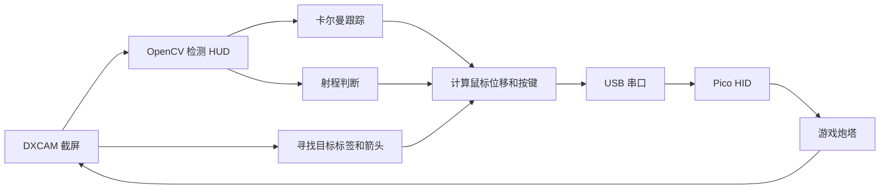
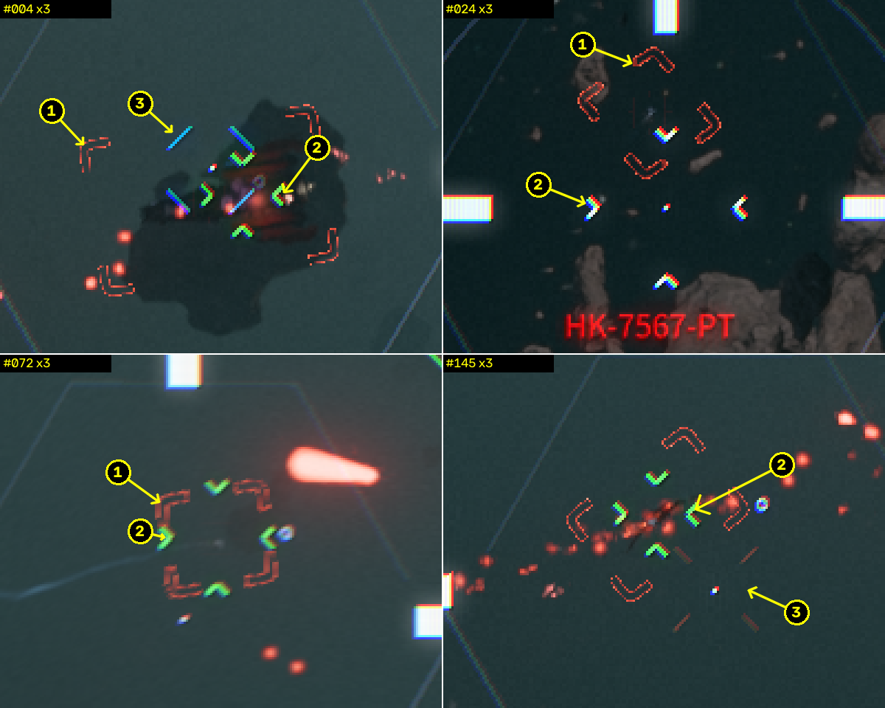

# 实现原理

[返回首页](../README.md)

本文记录屏幕识别、目标跟踪和炮塔控制的实现。安装与操作步骤见[首页](../README.md)。

## 处理流程

Python 主程序与游戏运行在同一台 Windows 电脑上。Pico 接收串口命令，通过 HID 报告输出鼠标或键盘输入。每次循环依次完成画面捕获、HUD 检测、轨迹更新、控制量计算、指令发送和日志记录。

## HUD 检测

游戏 HUD 已经提供提前量点，我将其作为跟踪目标。检测依据主要是颜色和形状：准星由较大的白色条组成，提前量点由朝内的小折角组成，进入射程后提前量点和射程圈变为绿色。

实际画面中，白色元素存在彩色边缘，目标框可能与提前量点相连，激光和准星也会造成遮挡。因此检测器先按亮度和颜色筛选，再检查折角的形状和排列。具体尺寸、HSV 范围和例图见 [HUD 笔记](hud.md)。

新轨迹需要完整提前量点的连续多帧观测。轨迹建立后，才允许在预测位置附近接受部分遮挡的观测，以减少舰体亮斑造成的误识别。

相关代码：`host/detector.py`、`host/tracker.py`。

## 跟踪和炮塔延迟

卡尔曼滤波器估计提前量点的位置和速度，在观测短暂缺失时继续预测，超过设定时间后释放轨迹。偏离预测位置过远的观测会被过滤，避免轨迹跳转到其他亮点。

炮塔自身转动也会造成目标在画面中的位移。如果将这部分位移计入目标速度，控制器就会对自身操作产生的运动重复修正。我在 `own_motion.py` 中记录已发送的鼠标指令，按标定得到的延迟、平滑和增益估计画面位移，再从跟踪结果中扣除。

控制器根据准星与提前量点的误差输出鼠标位移，并加入目标速度前馈。Smith 预估用于补偿已发送但尚未反映在画面中的转向量，减少等待炮塔响应期间的重复修正。

默认配置还启用了提前瞄准，根据目标速度和炮塔延迟计算瞄准位置的预测偏移。位移上限、死区和增益均在 `control` 中配置。

相关代码：`host/tracker.py`、`host/own_motion.py`、`host/controller.py`。换炮塔或改了灵敏度，可以用 `tools/turret_ident.py` 重新标定。

## 目标搜索

提前量点尚未进入检测区域时，程序根据红色目标标签或屏幕外方向箭头转向。接近标签后短暂停留，等待提前量点检测和跟踪接管。

持续没有检测到标签或箭头时，程序按 T 尝试锁定。默认等待 2 秒，之后最多每 3 秒尝试一次；存在锁定提示时不重复发送。打开聊天框前需要关闭火控，避免 T 被输入到聊天框。

相关代码：`host/target_finder.py`、`host/search.py`、`host/main.py`。

## 射程和开火

射程判断同时看绿色提前量点和准星周围的绿色圈。射程圈在提前量点被挡住时也可能看得见，但如果明确检测到白色提前量点，就按射程外处理。绿色信号需要持续至少 80 ms、连续至少 3 帧，才算进入射程。

我将自动开火与跟踪分开控制。开启武器开关后，满足射程条件即开始射击，持续到目标丢失超过 `fire.stop_after_unlocked_s`，默认 1 秒。单帧绿色信号缺失不会立即中断射击；单次连射时长可通过 `fire.max_burst_s` 限制。

相关代码：`host/weapon_range.py`、`host/fire_control.py`。状态机位于 `host/state_machine.py`，主循环位于 `host/main.py`。

## 停止和日志

浮窗的火控开关关闭后会停止控制；武器开关只管开火。游戏不在前台时暂停输入，退出时发送 STOP。Pico 固件也有 100 ms 的超时释放，主机不再发命令时会松开按键并把摇杆回中。

每帧的数据写到 `logs/session_*.csv`，包括检测位置、跟踪结果、鼠标输出和状态。获得目标、丢失目标、开始和停止开火等事件会保存截图，方便之后回放排查。录制和标定工具的命令放在[操作说明](usage.md)里。

当前参数基于我使用的 2560×1440 Polaris 炮塔画面标定。更换 HUD、分辨率或灵敏度后，需要重新调整像素尺寸和炮塔响应参数。`tests/` 中的离线测试用于检查检测和控制逻辑，由 Windows/Linux CI 自动运行。
