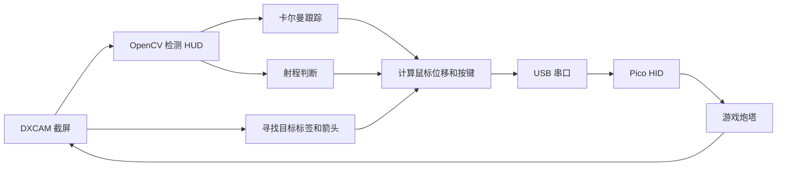

# 实现笔记

[返回首页](../README.md)

这篇主要写代码里每一步在做什么，以及为什么要这样处理。想直接用的话，看首页的安装和使用就够了。

## 从画面到鼠标

Python 和游戏在同一台 Windows 电脑上。Pico 接收串口命令，再通过 HID 报告把它们变成鼠标或键盘输入。一次循环大致就是拿到新画面、检测、更新跟踪、计算控制量、发送指令，最后记录日志。

## 识别 HUD

游戏已经算好了提前量，所以我跟踪的是屏幕上的提前量点。检测主要看颜色和形状：准星是较大的白色条，提前量点是几个朝内的小折角，进入射程后提前量点和射程圈会变绿。

实际画面比单纯按颜色取点麻烦。白色元素周围有彩色边缘，目标框可能贴住提前量点，激光和准星也会把它挡住。因此检测器先按亮度和颜色筛选，再检查折角的形状和排列。具体尺寸、HSV 范围和例图见 [HUD 笔记](hud.md)。

刚开始跟踪时，需要完整的提前量点连续出现几帧；已经跟上以后，才允许在预测位置附近接受部分遮挡的点。这样能少把舰体上的亮斑当成目标。

相关代码：`host/detector.py`、`host/tracker.py`。

## 跟踪和炮塔延迟

卡尔曼滤波器估计提前量点的位置和速度，短暂看不到时先按预测继续更新，超过设定时间再丢掉轨迹。离预测位置太远的观测会被过滤，避免突然跳去跟踪别的亮点。

还有一个问题是自己转炮塔也会让目标在画面里移动。如果把这些位移都算成目标速度，控制器就会追着自己造成的运动修正。我用 `own_motion.py` 记录发出去的鼠标指令，按标定得到的延迟、平滑和增益估计画面应该移动多少，再从跟踪里扣掉这部分。

控制器根据准星与提前量点的误差输出鼠标位移，并加入目标速度前馈。Smith 预估处理的是另一部分：指令已经发出去，但炮塔还没转到位的量。把这部分算进去，可以避免等待画面响应期间不断追加同样的修正。

默认配置里还开了提前瞄准，根据目标速度和炮塔延迟，把瞄准位置向前推一点。位移上限、死区和增益都在 `control` 里。

相关代码：`host/tracker.py`、`host/own_motion.py`、`host/controller.py`。换炮塔或改了灵敏度，可以用 `tools/turret_ident.py` 重新标定。

## 找目标

提前量点还没进入检测区域时，先找游戏里的红色目标标签，或者屏幕外的方向箭头，再朝那个方向转。接近标签后会短暂停下来，让提前量点检测和跟踪接管。

如果一段时间没有看到标签或箭头，就按一次 T 尝试锁定。默认是等 2 秒，之后最多每 3 秒按一次；看到锁定提示时不会反复按。聊天框也会接收这个 T，所以开聊天前要关火控。

相关代码：`host/target_finder.py`、`host/search.py`、`host/main.py`。

## 射程和开火

射程判断同时看绿色提前量点和准星周围的绿色圈。射程圈在提前量点被挡住时也可能看得见，但如果明确检测到白色提前量点，就按射程外处理。绿色信号需要持续至少 80 ms、连续至少 3 帧，才算进入射程。

我把是否开火单独做成了一个开关。开启后，满足条件就开始射击，然后持续到目标丢失超过 `fire.stop_after_unlocked_s`，默认 1 秒。这里不会因为某一帧没看见绿色就立刻松开。想限制单次连射长度，可以配置 `fire.max_burst_s`。

相关代码：`host/weapon_range.py`、`host/fire_control.py`。总状态由 `host/state_machine.py` 管，主循环在 `host/main.py`。

## 停止和日志

浮窗的火控开关关闭后会停止控制；武器开关只管开火。游戏不在前台时暂停输入，退出时发送 STOP。Pico 固件也有 100 ms 的超时释放，主机不再发命令时会松开按键并把摇杆回中。

每帧的数据写到 `logs/session_*.csv`，包括检测位置、跟踪结果、鼠标输出和状态。获得目标、丢失目标、开始和停止开火等事件会保存截图，方便之后回放排查。录制和标定工具的命令放在[操作说明](usage.md)里。

这套参数是按我的 2560×1440 Polaris 炮塔画面调出来的。其他 HUD、分辨率或灵敏度要重新调相应参数，尤其是像素尺寸和炮塔响应。`tests/` 里的离线测试用于检查检测和控制逻辑，Windows/Linux 的 CI 会运行这些测试。
